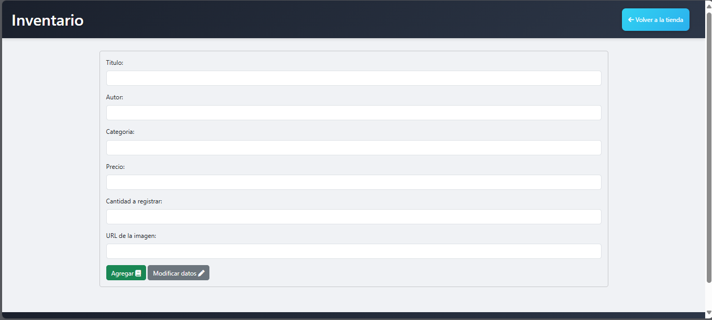
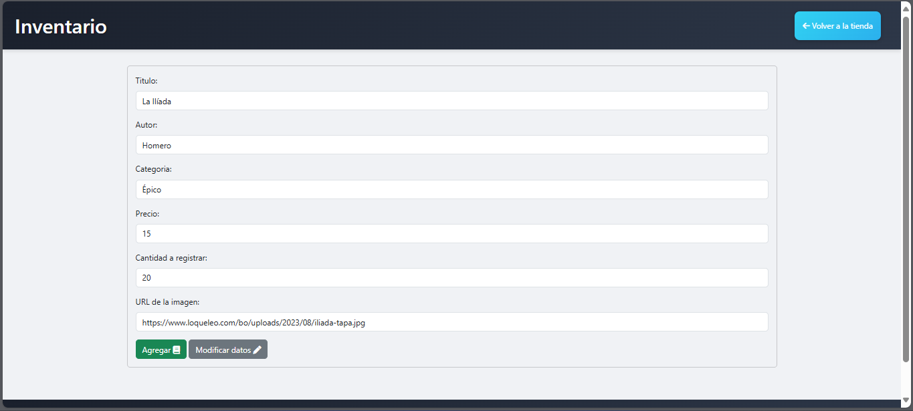
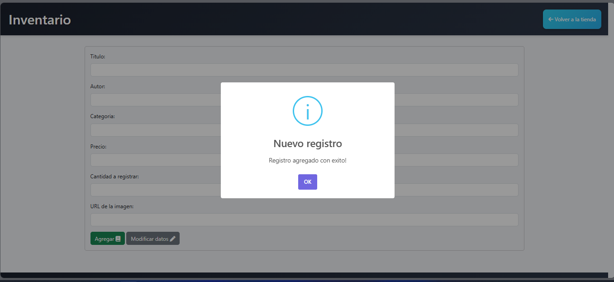
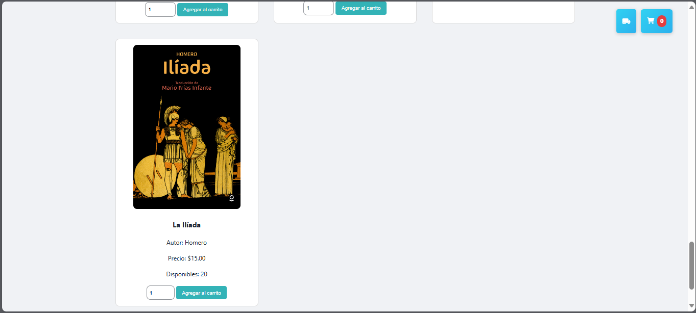
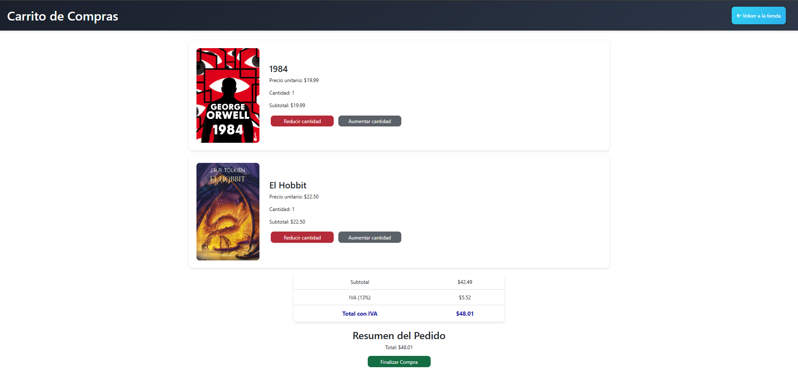

# Libreria El Binario 

## Descripción
La siguiente Aplicacion tiene como fin ayudar en la venta y adminitracion de inventatios de libros. Podemos ver que como pagina principal se nos muestran los libros existenten en la tienda.

en esta parte Se debe de selaccionar la cantidad de Libros a comprar y dar clic a a agregar carrito y se no mostrar un mensaje de que el libro a sido agregado al carro como se muestra en la imagen.

## Inventario

Veamos el siguiente formilario, cuenta con un formulario donde podemos ver los campos de Titulo, Autor, Categoría, Precio, Cantidad y URL de la imagen.

Al llenar los datos del formulario tomamos en cuenta que utilzaremos la url de de la imagen de la portada del libro que se visualizará en la página principal, es importante llenar el formulario a como se muestra en el siguiente ejemplo:

Una vez finalizado, podemos darle click en el boton verde de Agregar y tendríamos la siguiente alerta éxito:

Ahora podemos volver a la página principal y visualizar el último libro que acabamos de agregar con los datos que ingresamos en el formulario:

## Carrito
El siguiente enunciado muestra las opcciones disponibles para poder manipular los productos seleccionados. Se puede agregar 1 o más libros o eliminar si así se desea.

## Factura
El siguiente enunciado muestra la parte que genera la factura. Despues de dar click en finalizar compra, se le muestra al usuario un menu donde puede generar factura o volver a la pagina principal. 

luego de dar click en generar factura, se descarga un archivo en formato PDF desde el navegar. 

Finalmente, la factura contiene toda la informacion que usuaria necesita y resume el pedido y el total de la compra: 

