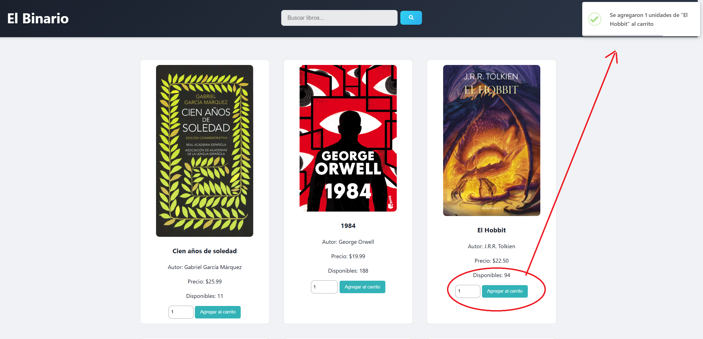

# Libreria El Binario 

## Descripción
La siguiente Aplicacion tiene como fin ayudar en la venta y adminitracion de inventatios de libros. Podemos ver que como pagina principal se nos muestran los libros existenten en la tienda.

en esta parte Se debe de selaccionar la cantidad de Libros a comprar y dar clic a a agregar carrito y se no mostrar un mensaje de que el libro a sido agregado al carro como se muestra en la imagen.

## Factura
El siguiente enunciado muestra la parte que genera la factura. Despues de dar click en finalizar compra, se le muestra al usuario un menu donde puede generar factura o volver a la pagina principal. 

luego de dar click en generar factura, se descarga un archivo en formato PDF desde el navegar. 

Finalmente, la factura contiene toda la informacion que usuaria necesita y resume el pedido y el total de la compra: 

